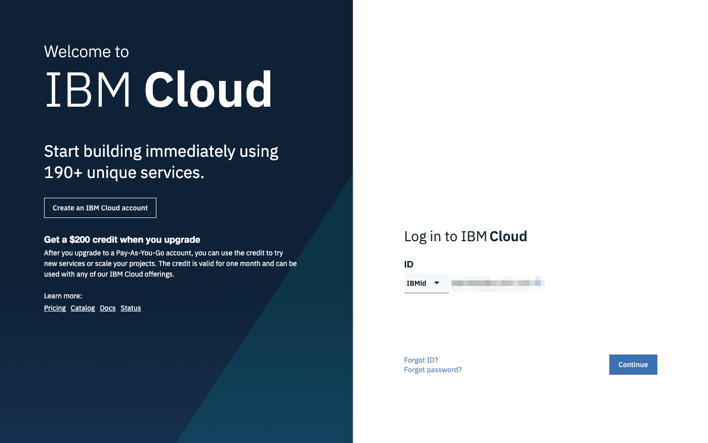
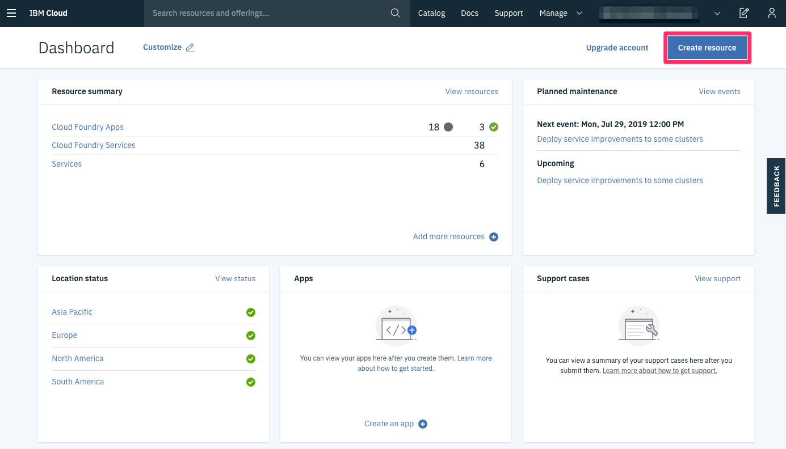

# Accelerator for Cloud-native Apps in IBM Cloud Pak for Applications

**IBM Cloud Pak for Applications helps you modernize existing applications and develop new cloud-native applications that can quickly deliver value. This lab demonstrates the Accelerators for Teams feature of IBM Cloud Pak for Applications by developing a cloud-native application and deploying it on Red Hat OpenShift using CI/CD features.**

### Pre-requisite: Create IBM Cloud Account [IBM Cloud](https://ibm.biz/BdqAuc). Please register with your Organization Email ID.

## IBM Cloud Login

Start by opening a web browser and navigating to [IBM Cloud](https://cloud.ibm.com/).

Next **_login_** with your IBM Cloud login you created. After login you will be navigated to your **Cloud Dashboard**.

To start execution of the lab, please navigate to [Build and deploy cloud-native Java applications using IBM Cloud Pak for Applications](https://developer.ibm.com/patterns/build-deploy-cloud-native-java-applications-using-ibm-cloud-pak-for-applications/)
