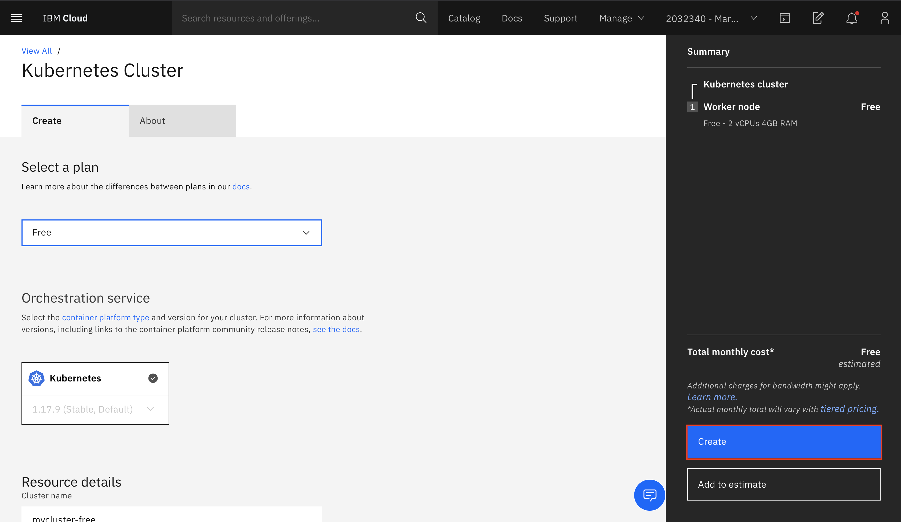
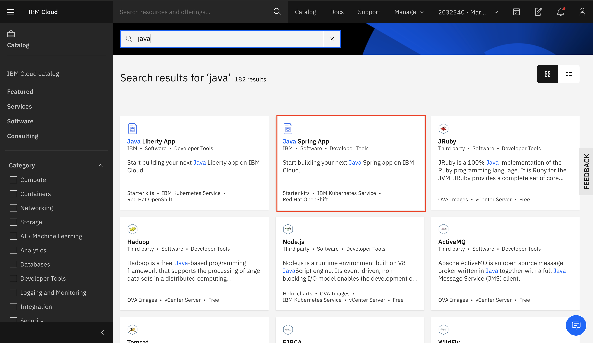

# Build a Cloud Native App with Automated DevOps from a Starter Kit

### Pre-requisite: Create IBM Cloud Account [IBM Cloud](https://ibm.biz/BdqAuc). Please register with your Organization Email ID.

## IBM Cloud Login

Start by opening a web browser and navigating to [IBM Cloud](https://cloud.ibm.com/).

Next **_login_** with your IBM Cloud login you created. After login you will be navigated to your **Cloud Dashboard**.

#### Create Kubernetes Cluster

From the catalog, navigate to Kubernetes Cluster and Select the Kubernetes Service

Select the free plan, give a name to the cluster and click on create

From the catalog, navigate to Java Spring App

Provide a name to the application and click on create

After the app is created, click on **Deploy your app**

Select the Kubernetes Service to deploy the app and click on **new** to create the API Key

Click on **OK** to create the API key

Select the appropriate region and your cluster to deploy the application and click on **Next**

You can see the build, containerize and deploy stage running. Click on **View logs and history** to get the URL of the application

At the bottom, click on the URL **View the Application At**  

If the application is successfully deployed, you should get the below output

**Congratulations on successfully building and deploying application on IBM Cloud**
