# Lab 4 - Deploying to OpenShift

## Overview / Background

In this lab we will work in the OpenShift Web Console and with the OpenShift `oc` CLI in the IBM Cloud Shell. The following image is a simplified overview of the topics of that lab. Have in mind that [OpenShift](https://www.youtube.com/watch?v=5dwMrFxq8sU&feature=youtu.be) is a [Kubernetes](https://www.youtube.com/watch?v=4ht22ReBjno) platform.

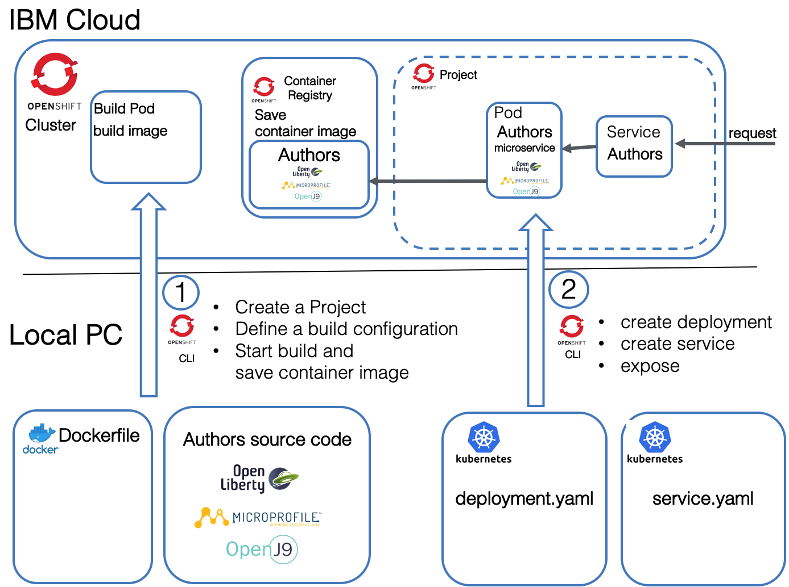

This lab has two parts:

1. Build and save the container image

  * We will create an OpenShift project
  * We will define a [build config](https://docs.openshift.com/container-platform/3.9/dev_guide/builds/index.html) for OpenShift
  * We will build with the build Pod inside OpenShift and save container image to the internal [OpenShift container registry](https://docs.openshift.com/container-platform/3.9/install_config/registry/index.html#install-config-registry-overview)

2. Deploy the application and expose the service

  * We will define and apply a deployment configuration (yaml) to create a Pod with our microservice
  * We will define a service which routes requests to the Pod with our microservice
  * We will expose the service

The following gif is an animation of the simplified steps above in a sequence.

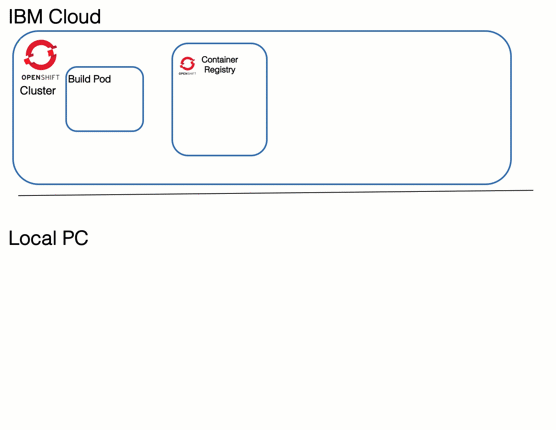


# 1. Build and save the container image

## Step 1: Create an Open Shift project

We need an OpenShift project, this is simply put equivalent to a Kubernetes namespace plus OpenShift security. You will be using this project throughout the whole workshop.  The easiest way is to use your own name in the form `yourfistname-yourlastname`, e.g. my project that you can see in many screenshots is 'harald-uebele'.

_Note:_ A [project](https://docs.openshift.com/container-platform/3.7/dev_guide/projects.html#overview) is similar to a namespace in Kubernetes with added security. It allows a community of users to organize and manage their content in isolation from other communities.

```
$ cd ${ROOT_FOLDER}/deploying-to-openshift
$ oc new-project <yourfistname-yourlastname>
```

## Step 2: Build and save the container image in the Open Shift Container Registry

We want to build and save a container image in the OpenShift Container Registry.

1. Define a new build as 'binary build' using the Docker strategy with name 'authors-bin' ([more details](https://docs.openshift.com/container-platform/3.5/dev_guide/builds/build_inputs.html#binary-source) and [oc new-build documentation](https://docs.openshift.com/container-platform/3.9/cli_reference/basic_cli_operations.html#new-build)). Result is a 'build config' on OpenShift.

    ```
    $ oc new-build --name authors-bin --binary --strategy docker
    ```

2. Starting the build process on OpenShift with our previously created build configuration. ([oc start-build documentation](https://docs.openshift.com/container-platform/3.9/cli_reference/basic_cli_operations.html#start-build)). This will result in the creation of a build pod which will end in status complete once the build = creation of a container image is successful.

    ```
    $ oc start-build authors-bin --from-dir=.
    ```

    Notice the period '.' at the end of the command. It means the build is using the current directory (of your IBM Cloud Shell session).

## Step 3: Verify the build in the OpenShift web console


1. In the 'Administrator' view, select 'Build', and 'Builds' again, select your project (yourfistname-yourlastname) in the pulldown:

   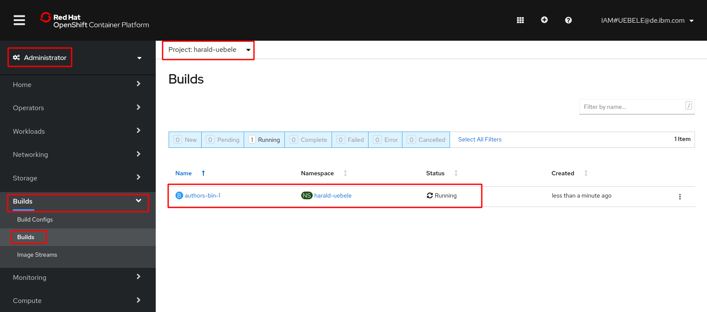

2. Click on the name of the build (e.g. 'authors-bin-1') and select the 'Logs' tab:

   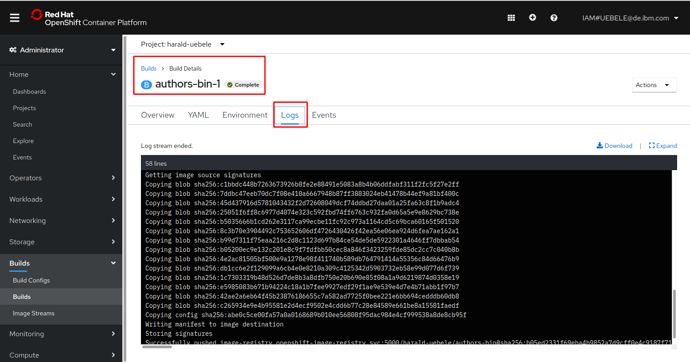

3. Inspect the logs. This is the log of the build-pod which contains everything that happened during creation of the container image. 'Push successful' means, the build has completed without errors and the resulting image has been loaded into the OpenShift internal image repository.

## Step 4: Verify the container image in Open Shift

1. Select 'Builds' then 'Image Streams'

   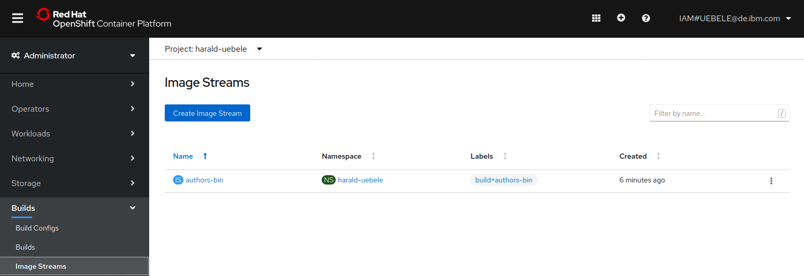

2. Click on the Image Stream 'authors-bin', note the 'Image Repository' information and the 'Tags':

   

    Note the full image name for a Kubernetes deployment, you will need it in the next step, e.g.:

    ```
    image-registry.openshift-image-registry.svc:5000/harald-uebele/authors-bin:latest
    ```

# 2. Deploy the Microservice

This deployment will deploy a container to a Pod in Kubernetes.
For more details we use the [Kubernetes documentation](https://kubernetes.io/docs/concepts/workloads/pods/pod-overview/) for Pods.

> A Pod is the basic building block of Kubernetes–the smallest and simplest unit in the Kubernetes object model that you create or deploy. A Pod represents processes running on your Cluster .

Here is a simplified image for that topic. The deployment.yaml file points to the container image that needs to be instantiated in the pod.

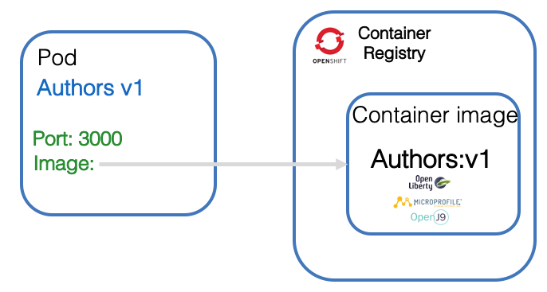

Let's start with the deployment yaml. For more details see the [Kubernetes documentation](https://kubernetes.io/docs/concepts/workloads/controllers/deployment/) for deployments.

Definition of `kind` defines this as a `Deployment` configuration.

```yml
kind: Deployment
apiVersion: apps/v1beta1
metadata:
  name: authors-bin
```

Inside the `spec` section we specify an app name and version label.

```yml
spec:
  ...
  template:
    metadata:
      labels:
        app: authors-bin
        version: v1
```

Then we define a `name` for the container and we provide the container `image` location, e.g. where the container can be found in the **Container Registry**. This location is specific for a given project.

The `containerPort` depends on the port definition inside our Dockerfile and in our server.xml.

We have previously talked about the usage of the HealthEndpoint class for our Authors service and here we see it the `livenessProbe` definition.


```yml
spec:
      containers:
      - name: authors-bin
        image: authors-bin:1
        ports:
        - containerPort: 3000
        livenessProbe:
```

This is the full [deployment.yaml](../deployment/deployment.yaml) file. Note that you will need to change the 'pull' name of the image location in the 'image:' parameter to the name of your project!

```yaml
kind: Deployment
apiVersion: apps/v1beta1
metadata:
  name: authors
spec:
  replicas: 1
  template:
    metadata:
      labels:
        app: authors
        version: v1
    spec:
      containers:
      - name: authors
        image: docker-registry.default.svc:5000/<projectname>/authors:latest
        ports:
        - containerPort: 3000
        livenessProbe:
          exec:
            command: ["sh", "-c", "curl -s http://localhost:3000/"]
          initialDelaySeconds: 20
        readinessProbe:
          exec:
            command: ["sh", "-c", "curl -s http://localhost:3000/health | grep -q authors"]
          initialDelaySeconds: 40
      restartPolicy: Always
```

## Step 1: Apply the deployment

1. Make sure you are in the right directory:

   ```
   $ cd ${ROOT_FOLDER}/deploying-to-openshift/deployment
   ```

2. Make a copy of 'template.deployment.yaml', name it 'deployment.yaml' file and replace the "image" location parameter with the full image name you found in 'Image Streams' details at the end of step 4 in part 1 of this workshop.
In the IBM Cloud Shell you can use `nano` as a simple text editor:

    ```
    $ cp template.deployment.yaml deployment.yaml
    $ nano deployment.yaml
    ```

   Save and exit the nano editor with Ctl-o and Ctl-x.

   Example:

   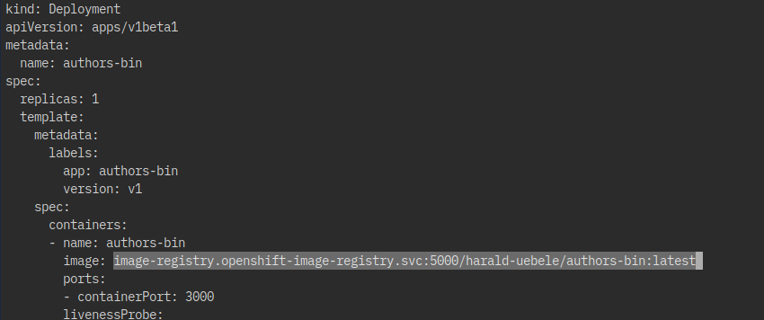

3. Apply the deployment to OpenShift

    ```
    $ oc apply -f deployment.yaml
    ```

## Step 2: Verify the deployment in OpenShift

1. Open the 'Developer' view in the OpenShift Web Console

1. Select 'Topology'

1. From the list of projects click on your project

1. Click on the name ('authors-bin') or the OpenShift icon, select 'Resources'. You should see a running pod:

   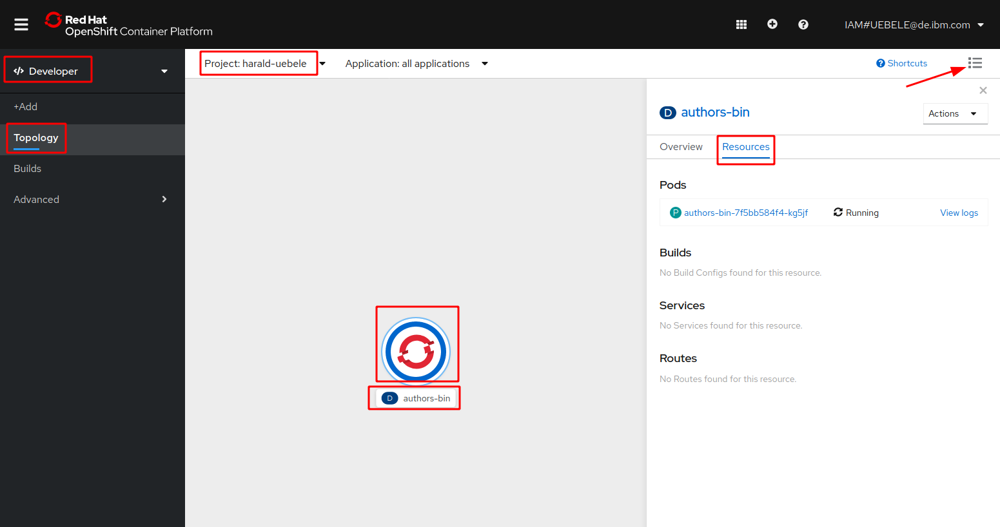

1. Click on the 'List' icon and in the list view, click on the name 'authors-bin':

   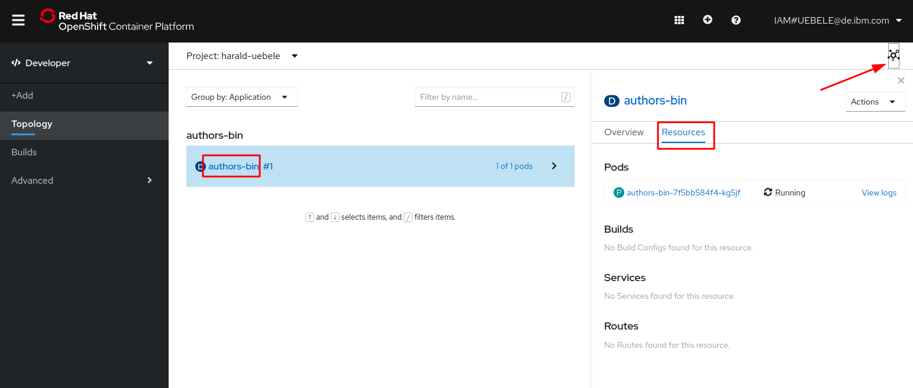

# 3. Apply the service.yaml

After the definition of the Pod we need to define how to access the Pod. For this we use a service in Kubernetes. For more details see the [Kubernetes documentation](https://kubernetes.io/docs/concepts/services-networking/service/) for service.

> A Kubernetes Service is an abstraction which defines a logical set of Pods and a policy by which to access them - sometimes called a micro-service. The set of Pods targeted by a Service is (usually) determined by a Label Selector.

In the service we map the NodePort of the cluster to the port 3000 of the Authors microservice running in the authors Pod, as we can see in the following picture.

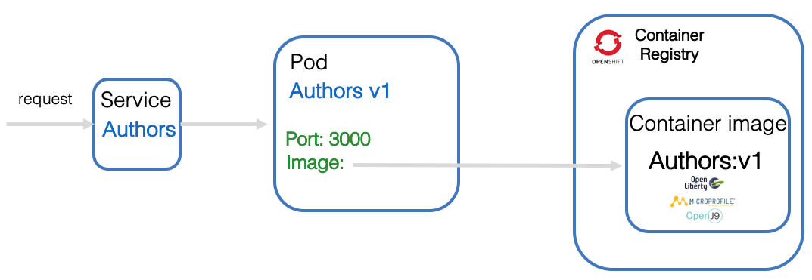

In the [service.yaml](../deployment/service-os.yaml) we see a selector of the pod using the label 'app: authors'.

```yaml
kind: Service
apiVersion: v1
metadata:
  name: authors-bin
  labels:
    app: authors-bin
spec:
  selector:
    app: authors-bin
  ports:
    - port: 3000
      name: http
  type: NodePort
---
```

## Step 1: Apply the service deployment

1. Apply the service to OpenShift

    ```
    $ oc apply -f service.yaml
    ```

2. Using oc [expose](https://docs.openshift.com/container-platform/3.6/dev_guide/routes.html) we create a Route to our service in the OpenShift cluster. ([oc expose documentation](https://docs.openshift.com/container-platform/3.9/cli_reference/basic_cli_operations.html#expose))

    ```
    $ oc expose svc/authors-bin
    ```

3. Back in the OpenShift Web Console, Topology view, you can now see the pod, the service, and the route:

    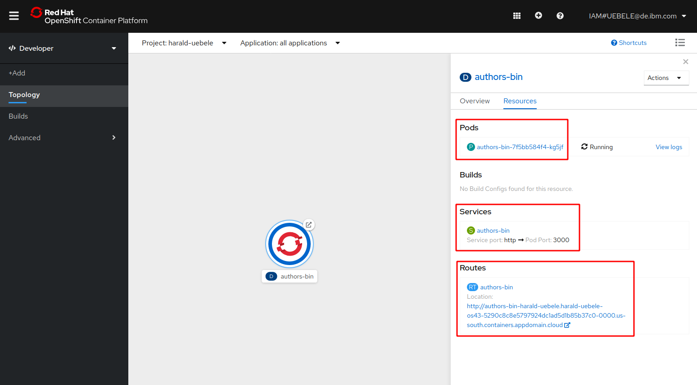

## Step 2: Test the `authors-bin` microservice

1. Execute this command, copy the URL to open the Swagger UI in browser

    ```
    $ echo http://$(oc get route authors-bin -o jsonpath={.spec.host})/openapi/ui/
    ```

    Result:
    ```
    $ http://authors-cloud-native-starter.openshift-devadv-eu-wor-160678-0001.us-south.containers.appdomain.cloud/openapi/ui/
    ```

    This is the Swagger UI in your browser:

   

1. Execute this command to verify the output:

    ```
    $ curl -X GET "http://$(oc get route authors-bin -o jsonpath={.spec.host})/api/v1/getauthor?name=Niklas%20Heidloff" -H "accept: application/json"
    ```

2. Result:

    ```
    {"name":"Niklas Heidloff","twitter":"https://twitter.com/nheidloff","blog":"http://heidloff.net"}
    ```


---
