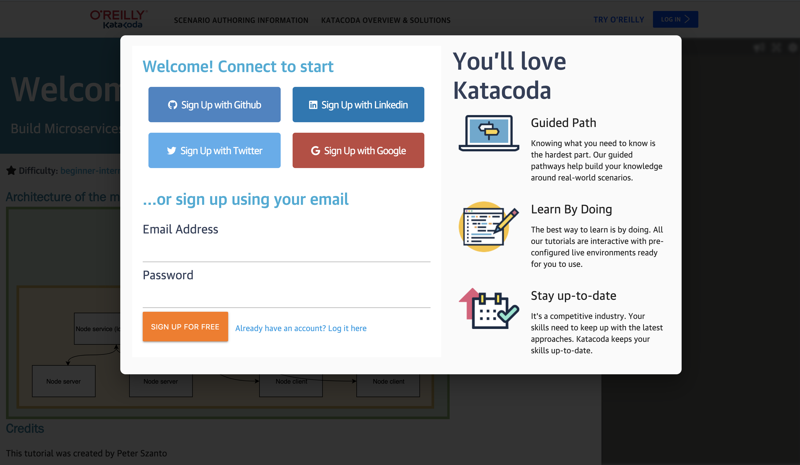
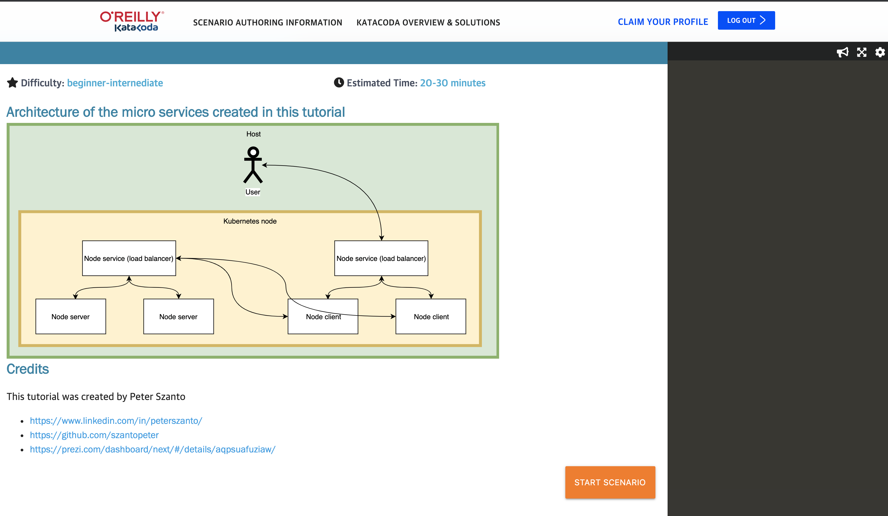

# Build Microservices with Docker and Kubernetes

## Pre-requisites

* [Sign up on Katacoda](https://www.katacoda.com/szantopeter/scenarios/kubernetes-basic)

## Steps

1. Login to Katacoda environment
2. Run nodejs server natively
3. Run nodejs server in docker
4. Run nodejs server in kubernetes
5. Microservices in Kubernetes
6. Kubernetes deployment descriptors

## 1. Login to Katacoda environment

Login to this lab [Build Microservices with Docker and Kubernetes](https://www.katacoda.com/szantopeter/scenarios/kubernetes-basic)

## 2. Getting started

To get started click on the start scenario button

**Happy learning!!**
