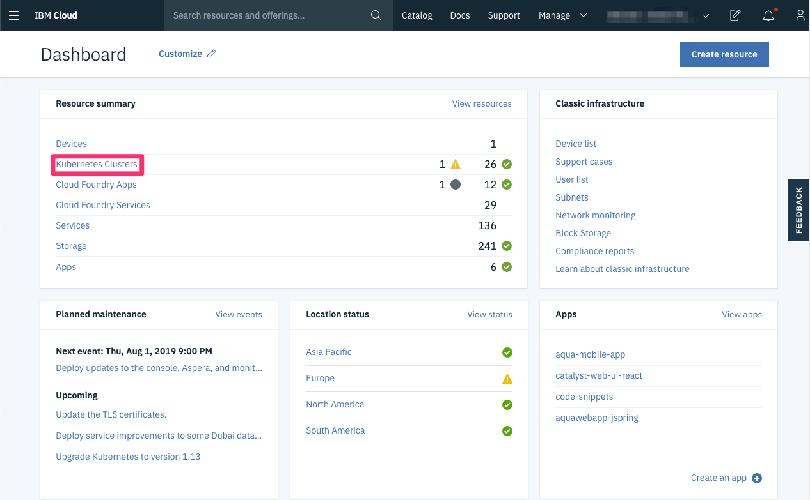
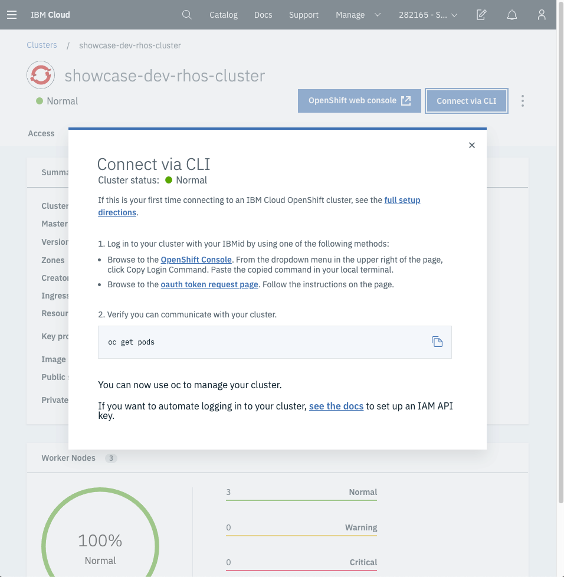
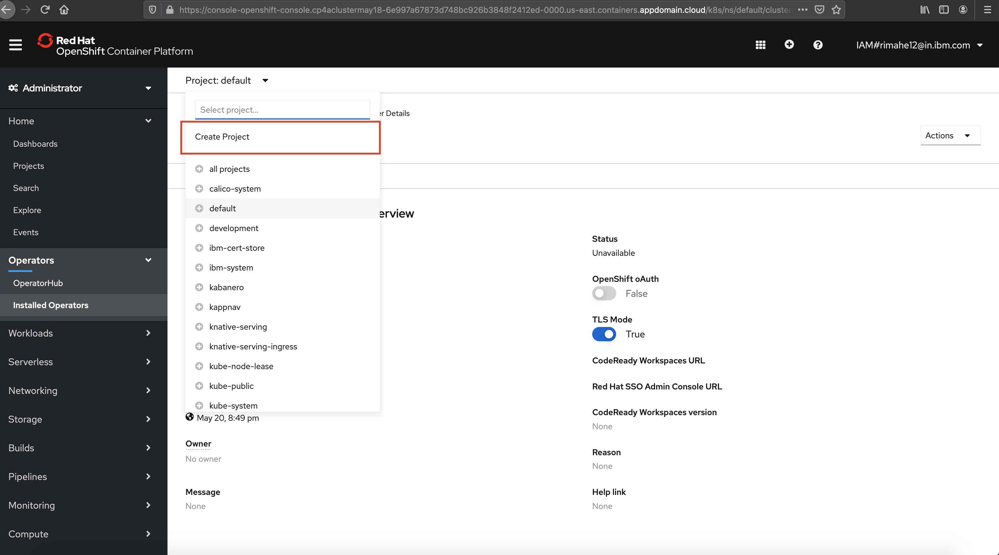
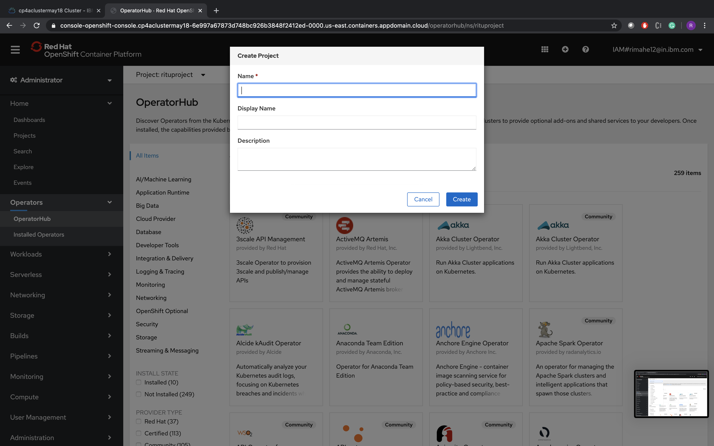

## Prerequisites

- Read and understand resource groups: [IBM Cloud Resource Groups](https://cloud.ibm.com/docs/resources?topic=resources-rgs)
- You will need an IBM Account for [IBM Cloud](https://cloud.ibm.com/)
- Downloaded and installed the OpenShift CLI at [OpenShift CLI Installation](https://OpenShift.io/docs/tasks/tools/install-kubectl/). Follow the instructions for your computer’s operating system.
- Downloaded and installed the IBM Cloud CLI at [IBM Cloud CLI Installation](https://cloud.ibm.com/docs/cli?topic=cloud-cli-getting-started#step1-install-idt). Follow the instructions for your computer’s operating system.

## IBM Cloud Login

Start by opening a web browser and navigating to [IBM Cloud](https://cloud.ibm.com/).

Next **_login_** with your IBM Cloud login you created. After login you will be navigated to your **Cloud Dashboard**.

On the **Cloud Dashboard** in the resource summary section, select **OpenShift Clusters**.

In cluster list, select the cluster you would like to access. Make sure the cluster you select has a red circle OpenShift icon next to it.

## Accessing the OpenShift Cluster

Once on the **Overview** screen of your OpenShift cluster, select the **Connect via CLI** in the upper right hand corner.

From this screen there are two options. One is using the **OpenShift Console** and the other is to use the **CLI via the oauth token request page** Once logged in to either the **OpenShift Console** or **CLI** we need to get the sample application.

## Walk-through: OpenShift on IBM Cloud

With the OpenShift Console open, let’s **Create a Project**

#### Create Project

On the top _click_ on **Create Project**

Next, fill in the name section with **project name** and _click_ **Create**

You will see that a new project was created in the list.

### Conclusion

You have successfully completed this lab!
