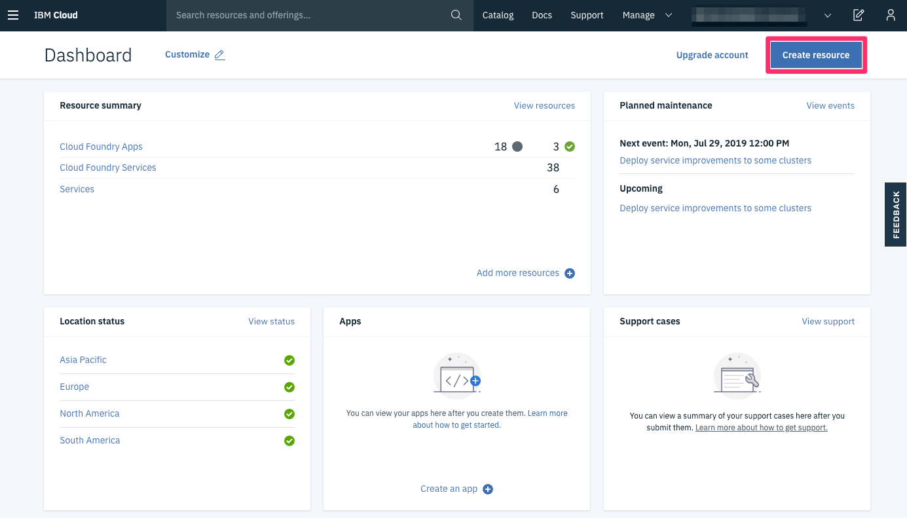

# Working with OpenShift operators to deploy a database on Red Hat OpenShift on IBM Cloud

### Pre-requisite: Create IBM Cloud Account [IBM Cloud](https://cloud.ibm.com/registration). Please register with your Organization Email ID.

## IBM Cloud Login

Start by opening a web browser and navigating to [IBM Cloud](https://cloud.ibm.com/).


Next **_login_** with your IBM Cloud login you created. After login you will be navigated to your **Cloud Dashboard**.



#### Step 1. Find the community operator

Begin by switching to the administrator mode in OpenShift and browse to the OperatorHub. In the navigation, expand **Operators** and select **OperatorHub**:


Then search for **PostgreSQL** in the OperatorHub and click the Install button to install the **Dev4Devs community PostgreSQL operator**:


### Step 2. Subscribe to an operator

Now you need to select one your existing namespaces where you want to install the operator. This is the namespace where you can create instances of the database:


After you have installed an operator by subscribing to one of the channels to keep it up-to-date, you can view installed operators. In the navigation, under **Operators** select **Installed Operators**. Now you see the PostgreSQL operator:


### Step 3. Switch to the Developer view and create the database

Change your view from Administrator to Developer and select **Topology** to view your deployed operator.

Click on **+Add** link in the left hand panel and then select the Database tile, as shown in the following screen capture:


Next, in the developer catalog, select the Postgres **Database Database** tile for your operator:


Here you can select the size of the volume assigned to the database, as well as resource limits for the database. You can also specify the database name and namespace: for example, call the name creditdb and call the namespace example-bank, as shown in the following screen capture:


Here is the new database that was created through the operator. The databases CRD is now a Kubernetes native object that you can query through oc.

To verify the database run the below commands

```
oc project your_project_name

oc get pods

oc get databases
```

Not only does the operator instantiate the database instance — it also creates a PersistentVolumeClaim for database storage.

### Step 4. Connect to the database

Expose the service with oc expose to allow access from outside the cluster through an external IP. Note that OpenShift routes only support HTTP/HTTPS traffic, so you can’t use them to connect to the PostgreSQL instance:

```
oc expose deploy creditdb --port=5432 --target-port=5432 --type=LoadBalancer --name my-pg-svc

oc get svc
```
Now you can access the database from outside the cluster using the external IP previously described.

After the database is in production, you can delete the LoadBalancer. Deleting the LoadBalancer eliminates external access to the database and only allows services to connect to the database through an internal cluster IP or service.

### Summary

The OpenShift OperatorHub provides an “app store” kind of experience for finding and installing services into your OpenShift cluster. The OLM service and its command-line interface help you manage and keep your operators updated.

You can go to OperatorHub in your OpenShift 4.3 cluster to discover other services available to install in your cluster, or see [operatorhub.io](https://operatorhub.io/) for a larger list of operators that you can install manually.
