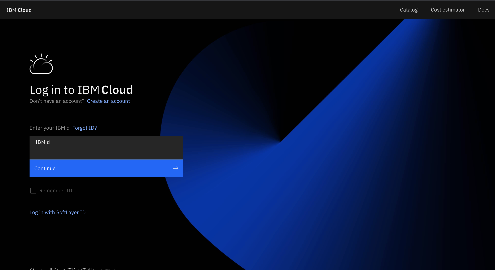
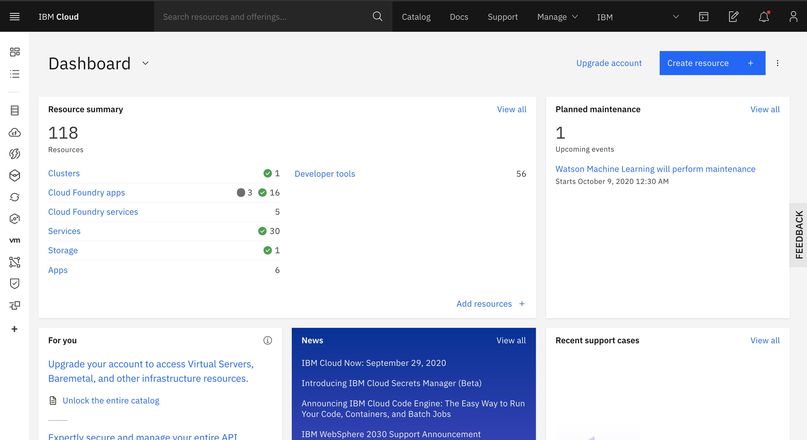
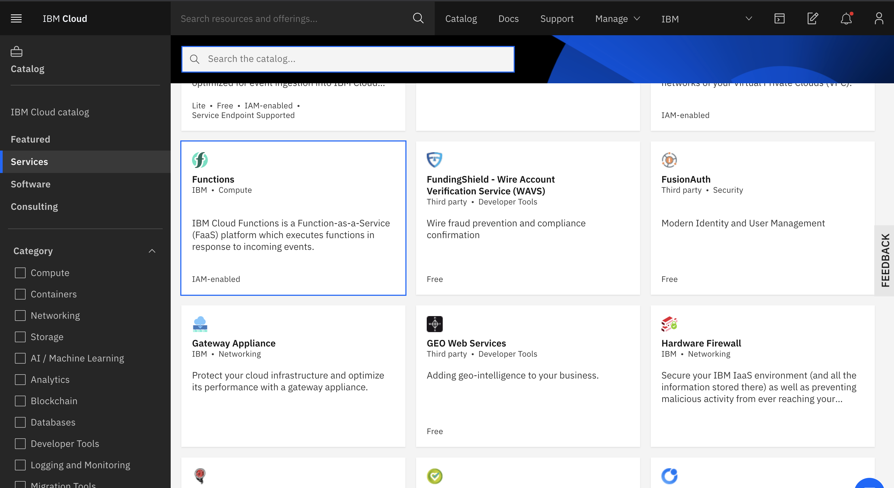
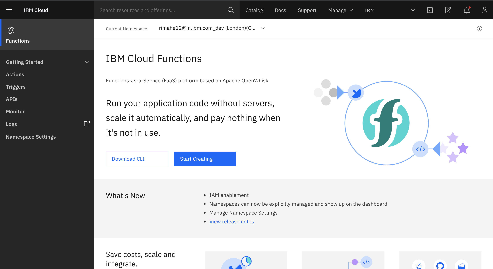

# Create, expose and secure a serverless function as an API

In this lab we will learn how to use IBM Visual Recognition service to classify images and how to use IBM Cloud Functions create a serverless action. Finally, we will also learn how to use the API Gateway service to securely expose the serverless function by creating and testing an API Endpoint.

Pre-requisite:

Create IBM Cloud Account [IBM Cloud](https://cloud.ibm.com/registration). Please register with your Organization Email ID.

## IBM Cloud Login

Start by opening a web browser and navigating to [IBM Cloud](https://cloud.ibm.com/).

Next **_login_** with your IBM Cloud login you created. After login you will be navigated to your **Cloud Dashboard**.

### Create an IBM Cloud Functions

From the catalog select the Functions Service

Begin by clicking on **Start Creating**

To start execution of the lab, please navigate to [Create, expose, and secure a serverless function as an API](https://developer.ibm.com/tutorials/create-expose-secure-serverless-functions-using-ibm-api-gateways-vr/)
